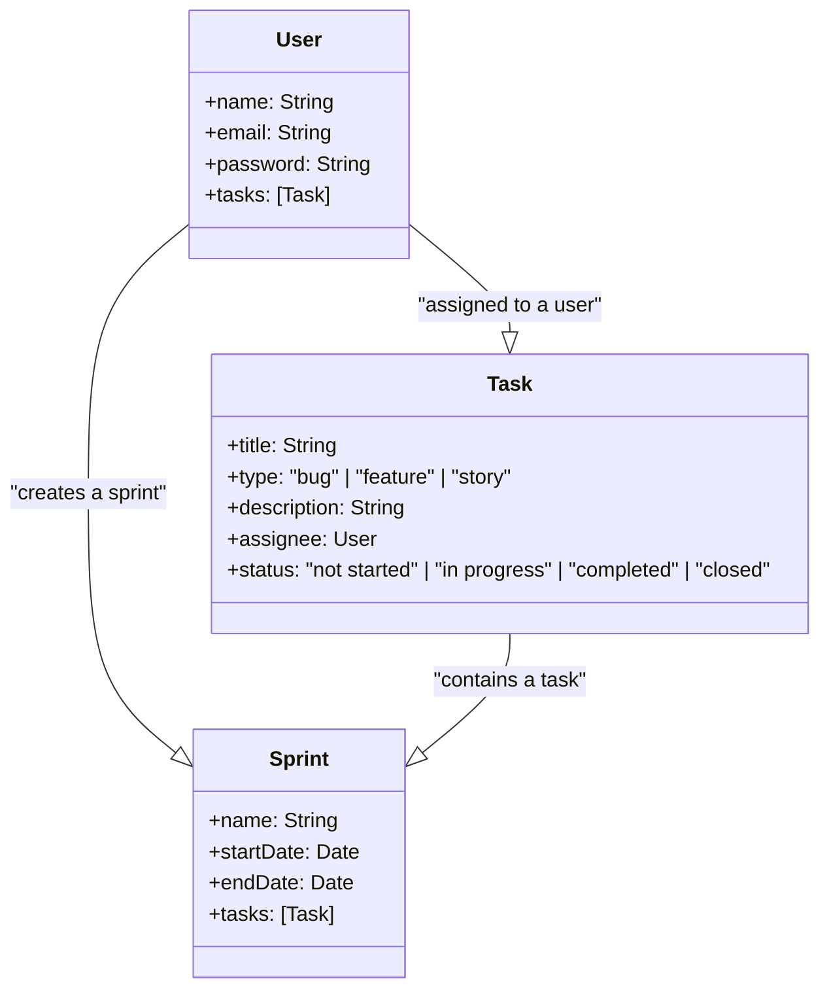

# TaskFlow Task Planner App

## Introduction

TaskFlow is a task planner application that allows users to manage and track different types of tasks, such as bugs, features, and stories. It provides a comprehensive set of features to create sprints, add tasks to sprints, change task assignees and statuses, and view tasks associated with specific sprints. This readme file provides an overview of the application's features, technologies used, and instructions for setting up and running the project.
## Features

This project has the following features:

* Create tasks with the following attributes
* Manage sprints
* User management
* Task management



## Technologies Used

The taskFlow application utilizes the following technologies:

- Frontend:
  - React: A JavaScript library for building user interfaces.
  - ChakraUI: A simple and modular UI component library for React.
  - Zustand: A small and fast state management library for React.
  - React Query: A data-fetching and caching library for React applications.
  - Formik: A form library for handling form input and validation in React.
  - Moment: A library for parsing, validating, manipulating, and formatting dates and times in JavaScript.
  - Yup: A JavaScript schema builder for value parsing and validation.

- Backend and Database:
  - Node.js: A JavaScript runtime for server-side development.
  - Express: A web application framework for Node.js.
  - JWT (JSON Web Tokens): A standard for securely transmitting information between parties as a JSON object.
  - Mongoose: An object data modeling (ODM) library for MongoDB and Node.js.
  - MongoDB: A document-oriented NoSQL database.

## Getting Started

To run the TaskFlow application locally, please follow the steps below:
To install this project, you will need the following:

* Node.js (npm)
* MongoDB
* Git

Once you have installed Node.js, MongoDB and Git, you can install this project by running the following command in your terminal:


1. Clone the repository:

```bash
git clone https://github.com/itsApurba/taskFlow.git
```

2. Navigate to the project directory:

```bash
cd taskFlow
```

3. Install the dependencies for both the frontend and backend:

```bash
# Install frontend dependencies
cd frontend
npm i

# Install backend dependencies
cd backend
npm i
```

4. Set up the environment variables:

- Create a `.env` file in both directories.
- Provide the necessary environment variables, such as database connection details, JWT secret, etc.

5. Start the development servers:

```bash
# Start the frontend server
cd frontend
npm start

# Start the backend server
cd vackend
npm start
```

6. Access the application in your web browser:

Open your preferred web browser and visit `http://localhost:5173` to access the taskFlow application.
